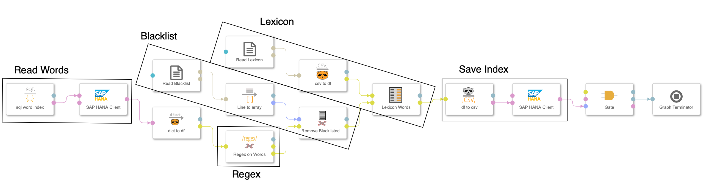

# Text Analysis Framework deployed on SAP Data Intelligence

## Introduction

There are basically 2 approaches for doing a text analysis: 

1. Brute force blackbox single step approach or 
2. Step-by-step

The brute force approach is using a text as a whole and classifies the text by using 'Deep Learning' techniques. The most familiar classifications are the **sentiment** and **subjectivity** polarity. Based on the type of the corpus the result could be quite good even for short texts like in twitter or movie and product reviews. But due to the very nature of language of being able to convey all kinds of information in numerous ways and that you need mostly an extensive amount of trained data this approach is of limited practicality.

The second step-by-step approach could also use models trained by *deep learning* techniques but in a more controlled way and combined with other techniques in a kind of process pipeline. For example for the grammatical analysis a deep learning trained model could be of great use to create word bags that can subsequently been evaluated to find similiar topics in texts by applying cluster algorithms. 

For a proof-of-concept we have done both ways. A simple sentiment scoring of the texts and a word indexing pipeline. The word index can then be used for 
further researches like the 

1. trend of postively annotated brands in news or forums or
2. word groups with a high corrollation probability

As a text corpus we are using online media articles that we scrape on a daily basis. For a start we selected 2 French (Le Figaro, Le Monde), 2 Spanish (El Mundo, El Pais) and 3 German newspaper (Der Spiegel, FAZ, Süddeutsche).
 

## Website Scraping with *Scrapy*

For the website scraping we used the open source tool framework [scrapy](http://scrapy.org). With limited effort we could create so-called spiders for each website that extracts the information we sought after. For automating this article retrieval process we

1. created a docker container with installed scrapy and the folder structure needed and
2. developed an configurable operator that receives the specific scrapy configuration files (setting.py, pipelines.py, items.py, middleware.py and spider.py) 

There are numerous online tutorials for scrapy but as a start you can go for the official [scrapy tutorial](https://docs.scrapy.org/en/latest/intro/tutorial.html).

The output of the operator are a *log-port* and a *data-port* sending the scraped data of each spider as a DataFrame. 

For our project we store the online articles using the *JSON*-format to an object store and additionally the metadata ('text_id', 'date', 'media', 'url', 'title', 'num_characters', 'rubric') in a HANA database. 

## Sentiment Analysis 
As a first step we used the sentiment algorithm of the NLP package [textblob](https://textblob.readthedocs.io/en/dev/index.html) for a quick win. Without further text cleansing we used the textblob algorithms for French, German and English to get the polarity (-1-negative to 1-positve) and the subjectivity (0-neutral to 1-subjective). The underlying algorithm is a model trained on movie reviews. If you take the results cum grano salis we learnt that the results are at least a good indicator.

Nonetheless I wanted to compare this with another, lexicographical technique summarizing words according to their annotated sentiment. Therefore I used a sentiment dictionary found in a publication of Peter Sheridan Dodds et. al. at [PNAS.org](https://www.pnas.org/content/112/8/2389) and calculated the average of the sentiments of the annotated words found in the articles. 

## Word Index
For the tokenization of the text we are using the open source framework [spaCy](https://spacy.io). For us it seemed to be the most advanced tool with the best performance. During the project we learnt that the most maintainable pipeline is to split the task into smaller processing steps:

1. **Pre-processing** (operator: Doc Prepare)  - formating the text, removing tags and common typos and converting it into our 'standard' format: 'text_id', 'language' and 'text' with data type DataFrame
2. **Word-bags** (operator: Words from Text) - Tokenizing the text and creating word bags of different types
3. **Blacklist** (operator: Remove Blacklisted) - Removing words that are on a 'blacklist' because they are very common and spoil the outcome. Optional step. 
4. **Remove pattern** (operator: Regex on Words) - Remove words with certain patterns that have not been removed in the *pre-processing* step or replace pattern. Although they are mostly quite rare they could unnecessaryly populate the Database. 
5. **Lexicon** (operator: Lexicon words) - Map words according to the lexicon file to predefined keywords, synonyms, etc. 

The output of the pipeline is the **word index** that stores 

* 'text_id' - reference to text, 
* 'language', 
* 'type' - type of word (proper noun, noun, verb, location, person, ...),
* 'word', 
* 'count' - number of words in text

into a HANA database. 

For monitoring purpose the **word frequency** of the processed corpus is also stored to a separate csv-file. This helps to understand if some words should be removed via the *blacklist* or the *remove pattern* step.

For checking if the *remove pattern* step has only removed the intended words and replaced the intended patterns, another csv-file is produced.

The final pipeline looks quite complex but is nonetheless a straightforward process: 

# Github Structure

This repository has the following structure: 

* **/src** - contains the code of all di_textanalyis operators that can be modiefied and tested locally and uploaded using the *gensolution-package* ([on github](https://github.com/thhapke/sdi_utils)) or [pypi.org](https://pypi.org/project/sdi-utils/)
* **/solution** - containing the solution packages for the dockerfile, pipelines and operators. Each operator has a rudimentary documentation yet generated from the operator-code
* **/data_repository** - example data to test the operators

## Quadruple Jump of Text Analysis
The four parts of a text analysis are

1. Getting the corpus/corpora, texts that needs to be analysed 
2. Preparing the texts before funneling them into the analyse pipeline. Example: to add a language attribute, removing formating tags or correcting common format error like missing space between ending quotes and dots.
3. Identifying the words as tokens (space/dot/... separated) , grammatical and lematized items (verb, adjective, noun, ..) and as entities carrying some semantics like being a person, location or organization. 
4. Cleansing the resulting words by applying heuristics like blacklisted words that should be removed, pattern recognitions and lexicographical mappings. 

The result can be used for automatically **indexing texts**, finding **trends of words** or entities that are mentioned more frequently over time or finally identifying **topics**. Topics are set of words that appear together numerously in different texts.

or for saving the metadata of the article in a *HANA DB* table as reference

### Identifying Words as Grammatical and Semantic Entities
* **word_index** operator using spacy for tokenizing, lemmatising and further cleasing the text by heuristic rules and using a *blacklist-file* for words to be ommitted. A *lexicon.csv* can be used to map the words according to the lexicon lists. The result is stored as an index in a HANA DB table. 

### Detecting Sentiment Scoring 
* **sentiment analysis** to provide the *sentiment and subjectivity polarity* of the articles acccording to the used words

### Identifying Topics 
* **topic finding** operator uses an Latent Dirichlet Allocation algorithm to find word clusters that could interpreted as *topics*

# Short Introduction into Text Analysis
Text analysis examines a larger amount of texts (= 'corpora') by using a number of algorithms in order to extract information from it. The basic level is to divide the text into **tokens** and then into **words** with its grammatical attributes. From there you can apply the next level of analytical methods to classify the text according e.g. to the sentiment, subjectivity or topic. 

With lemmatized words (inflected form) and the identified type or grammatical position, an index can be build up, e.g. using all nouns or proper nouns like in a book index. Furthermore a dictionary can be used to kind of normalize the words into language independent keywords, e.g. 
'legal' <- legal, justice, judge, lawyer .. for English or <- gesetzlich, Richter, Gericht, Anwalt, ... for German.  

**Topics** are the next analytical level by putting words into a set. This can be either done by definition or in algorithmic terminology by searching for word clusters. That means e.g. that news articles can be categorized into 'primaries in US', 'US-China-Relationship', 'Brexit', ...

 

 